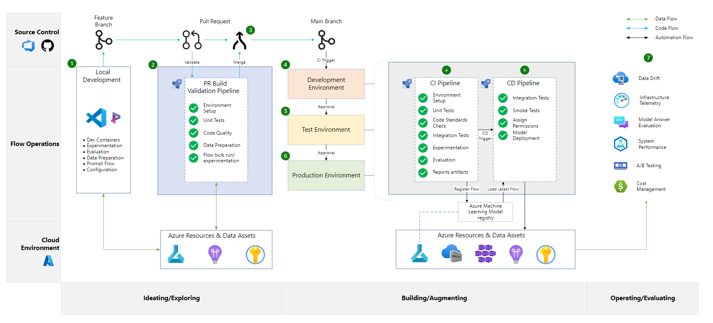

# End-to-End AI Customer Support Chatbot with deployment Flow

This project is an AI-powered customer support chatbot using Azure and OpenAI services. The chatbot can handle common customer queries and provide relevant information. 

- I have implemented this AI application using the End-to-End deployment Flow. 
- The main aim of this project is to show the deployment flow in a real world industry setting using all the tools and services for effective source control and deployments.
- Multiple applications can be included and deployed at the sametime using this structure.



## Table of Contents

1. [Customer Support Chatbot](#customer-support-chatbot)
2. [Project Structure](#project-structure)
3. [Getting Started](#getting-started)
   - [Prerequisites](#prerequisites)
   - [Installation](#installation)
4. [Running the Application](#running-the-application)
   - [Locally](#locally)
   - [Using Docker](#using-docker)
5. [Running Tests](#running-tests)
6. [CI/CD Pipeline](#cicd-pipeline)
7. [Contributing](#contributing)

## Project Structure
```
├── .github/
│ └── workflows/
│     └── ci-cd.yml
├── data/
│ ├── reference_data.csv
│ ├── new_data.csv
| ├── marketing_campaign.csv
├── reports/
│ └── data_drift_report.json
├── scripts/
│ ├── data_drift_monitoring.py
│ ├── evaluate_model.py
│ ├── set_up_telemetry.py
│ └── monitor_performance.py
├── Dockerfile
├── docker-compose.yml
├── docker-compose.dev.yml
├── docker-compose.test.yml
├── docker-compose.prod.yml
├── requirements.txt
├── README.md
└── .gitignore
```
## Prerequisites

### Prerequisites

1. **Python**: Python 3.9 or later
   - [Download Python](https://www.python.org/downloads/)
2. **Docker**: Docker for containerizing the application
   - [Install Docker](https://docs.docker.com/get-docker/)
3. **Docker Compose**: Docker Compose for managing multi-container Docker applications
   - [Install Docker Compose](https://docs.docker.com/compose/install/)
4. **Git**: Git for version control (optional but recommended)
   - [Install Git](https://git-scm.com/book/en/v2/Getting-Started-Installing-Git)
5. **OpenAI API Key**: An API key from OpenAI to access their GPT-3 model
   - [Get an OpenAI API Key](https://beta.openai.com/signup/)

6. **Azure Services**: Require different azure services for different use cases. You need the connection string, API key and all the related details needed to connect to a particular Azure service


## Setup and Installation

### 1. Clone the Repository

```sh
git clone https://github.com/AjayKrishna76/customer-support-chatbot.git
cd customer-support-chatbot
```
### 2. Install dependencies:
```sh
pip install -r requirements.txt
```
### 3. Set up environment variables:
- Ensure you have the `OPENAI_API_KEY` environment variable set for running the application.

## Running the Application
### Locally
To run the application locally, set the OPENAI_API_KEY environment variable and run the chatbot script.
```sh
export OPENAI_API_KEY=your_openai_api_key
python src/chatbot.py
```

### Using Docker
#### 1. Development Environment:
```sh
docker-compose -f docker-compose.yml -f docker-compose.dev.yml up --build -d
```

#### 2. Testing Environment:
```sh
docker-compose -f docker-compose.yml -f docker-compose.test.yml up --build -d
```

#### 3. Production Environment:
```sh
docker-compose -f docker-compose.yml -f docker-compose.prod.yml up --build -d
```

### Running Tests
To run the tests, you can use the following command:
```sh
docker-compose -f docker-compose.yml -f docker-compose.test.yml run app
```

## CI/CD Pipeline
The CI/CD pipeline is set up using GitHub Actions and is defined in .github/workflows/ci-cd.yml. It consists of the following stages:

### CI Pipeline
1. Environment Setup: Sets up the Python environment and installs dependencies.
2. Unit Tests: Runs unit tests to validate code functionality using pytest.
3. Code Standards Check: Ensures code adheres to standards using flake8.
4. Integration Tests: Runs integration tests to validate interactions between components.
5. Experimentation: Conducts experiments if necessary (e.g., hyperparameter tuning, model experiments).
6. Evaluation: Evaluates the model or system (e.g., performance metrics).
7. Reports Artifacts: Generates and stores reports (e.g., test coverage, performance).

### CD Pipeline
1. Integration Tests: Ensures integration tests are run during the CD pipeline as well.
2. Smoke Tests: Runs smoke tests to validate the basic functionality of the deployed system.
3. Assign Permissions: Assigns appropriate permissions if necessary.
4. Model Deployment: Deploys the model correctly to the production environment.
5. Monitoring: Sets up monitoring and logging for the production environment.

- The project is developed in three environments and are as follows
1. Build: Deploys to the development environment.
2. Test: Deploys to the test environment and runs the tests.
3. Deploy: Awaits manual approval before deploying to the production environment.

## Advantages of Using This CI/CD Workflow

1. **Automated Testing and Validation**:
    - **Consistency**: Ensures that all code changes are automatically tested and validated, reducing the risk of introducing errors into the production environment.
    - **Efficiency**: Automates unit tests, integration tests, and smoke tests, saving time and ensuring thorough validation of code changes.

2. **Seamless Deployment**:
    - **Environment Isolation**: Deploys code to separate development, test, and production environments, ensuring that changes are thoroughly tested before reaching production.
    - **Controlled Releases**: Facilitates controlled and gradual releases, allowing for easier rollback and troubleshooting if issues arise.

3. **Continuous Monitoring**:
    - **Data Drift Detection**: Integrates data drift monitoring to detect changes in data patterns that could impact model performance, ensuring the robustness of AI models over time.
    - **Infrastructure Telemetry**: Sets up infrastructure telemetry to monitor the health and performance of the deployment environment, enabling proactive maintenance and optimization.
    - **Model Evaluation**: Continuously evaluates model performance to ensure that deployed models meet desired accuracy and reliability standards.
    - **System Performance Monitoring**: Monitors system performance metrics such as response time and error rates, ensuring optimal user experience and system reliability.

4. **Security and Confidentiality**:
    - **Secret Management**: Utilizes GitHub Secrets to securely manage sensitive information such as API keys and connection strings, protecting them from unauthorized access.

5. **Scalability**:
    - **Modularity**: The workflow is modular, making it easy to extend and customize for additional testing, deployment, and monitoring tasks as the project evolves.
    - **Automation**: Reduces manual intervention, allowing the workflow to scale efficiently with the project and team size.

6. **Traceability and Documentation**:
    - **Comprehensive Logs**: Maintains detailed logs of all pipeline executions, providing traceability and accountability for changes and deployments.
    - **Documentation**: The CI/CD pipeline itself serves as a form of documentation, outlining the steps and checks involved in deploying and maintaining the project.

These advantages make the CI/CD workflow a robust and reliable choice for automating the development, testing, deployment, and monitoring processes of the customer support chatbot project, ensuring high quality and reliability of the deployed solution.

## Future Work

1. **Enhanced Model Training and Optimization**:
    - Implement advanced techniques for model training and hyperparameter optimization to improve the performance and accuracy of the chatbot.
    - Explore the integration of transfer learning and fine-tuning using more extensive and diverse datasets.

2. **Additional Monitoring and Alerting**:
    - Develop more sophisticated monitoring tools and dashboards for real-time performance tracking and anomaly detection.
    - Implement automated alerting systems to notify the team of potential issues such as data drift, system failures, or performance degradation.

3. **Scalability and Performance Improvements**:
    - Optimize the chatbot's infrastructure to handle increased load and ensure high availability and low latency.
    - Investigate and implement horizontal scaling solutions to accommodate a growing user base.

4. **Feature Expansion**:
    - Introduce new features to enhance user interaction, such as multi-language support, personalized responses, and sentiment analysis.
    - Integrate with additional communication channels like social media platforms, email, and voice assistants.

5. **Security Enhancements**:
    - Conduct regular security audits and implement advanced security measures to protect user data and maintain compliance with privacy regulations.
    - Develop more robust authentication and authorization mechanisms to secure the chatbot and its infrastructure.

6. **Continuous Improvement and User Feedback Integration**:
    - Establish a feedback loop to gather user input and continuously improve the chatbot's capabilities and user experience.
    - Implement A/B testing to experiment with different features and approaches, using data-driven insights to guide development.

### Contributing
Contributions are welcome! Please open an issue or submit a pull request.
